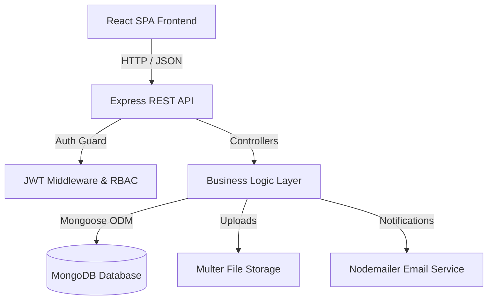

# 🏗 System Architecture & Design Specification

## Overview

The **Book a Doctor** application follows a decoupled 3-tier full-stack architecture:

1. **Presentation Layer (Frontend)**: Built with React.js, implementing custom React Context for global state, custom hooks, and standard REST API consumption via custom fetch/Axios service wrappers.
2. **Application Layer (Backend)**: Built with Node.js and Express, following MVC pattern (Routes -> Middleware -> Controllers -> Models).
3. **Data Layer (Database)**: MongoDB ODM managed via Mongoose.

## Security & Access Control

- **Authentication**: Stateless JSON Web Tokens (JWT) stored client-side.
- **Password Protection**: Passwords salted and hashed with `bcryptjs`.
- **Role-Based Access Control (RBAC)**:
  - `patient`: Can browse doctors, view profiles, book appointments, write reviews, view booking history.
  - `doctor`: Can manage availability schedules, view assigned appointments, update appointment status (Confirm/Complete/Cancel).
  - `admin`: Can oversee platform statistics, approve doctor profiles, manage all appointments, and inspect audit logs.
